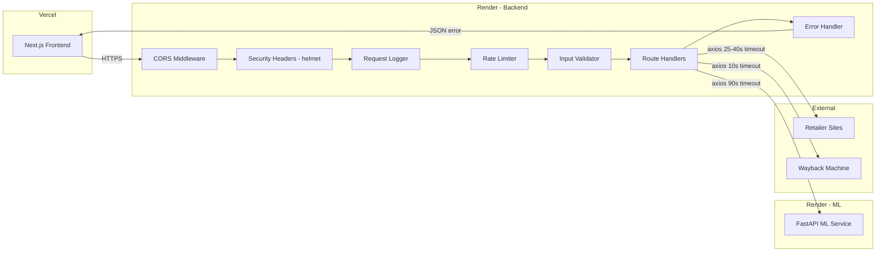

# Design Document: Backend Improvements

## Overview

This design covers hardening the VÉRA backend (Node.js/Express) into a production-ready API server. The backend sits between a Next.js 14 frontend on Vercel and a Python/FastAPI ML service on Render free tier. It orchestrates product page scraping and greenwashing analysis.

The improvements span 13 requirement areas: CORS lockdown, input validation, consistent error responses, scraper resilience, ML service communication, health checks, structured logging, graceful shutdown, rate limiting, response contracts, security headers, Docker optimization, and cold-start mitigation.

### Design Principles

- **Layered middleware**: Each concern (CORS, security headers, validation, logging, rate limiting) is a discrete Express middleware, composed in a clear order.
- **Fail-safe over fail-fast**: The backend always returns a classified JSON error rather than crashing. Health checks always return 200 so Render doesn't restart the container.
- **Frontend contract alignment**: Error shapes and status codes match what `apiClient.js` already classifies (`SCRAPE_FAILED` → 422, `ML_ERROR` → 503, `RATE_LIMITED` → 429).
- **Zero new runtime services**: All improvements use npm packages and code changes only — no Redis, no external log aggregators.

## Architecture

The architecture remains a single Express process. The changes add middleware layers and improve error handling within existing routes.



### Middleware Order

```
1. Security headers (helmet)
2. CORS (origin whitelist)
3. Body parser (1 MB limit)
4. Content-Type check (POST only)
5. Request logger
6. Rate limiter (/api/ routes)
7. Route handlers
8. 404 handler
9. Global error handler
```

## Components and Interfaces

### 1. CORS Middleware (`middleware/cors.js`)

Replaces the current `app.use(cors())` with an explicit origin whitelist.

```javascript
// Configuration
const ALLOWED_ORIGINS = [
  'https://vera-scanner.vercel.app',   // production
  /\.vercel\.app$/,                     // preview deployments
  'http://localhost:3000',              // local frontend
  'http://localhost:3001',              // local backend testing
];

// Reads ALLOWED_ORIGINS env var (comma-separated) to extend the list
// Uses cors({ origin: function }) to check each request origin
```

**Interface**: Standard Express middleware. No exports beyond the configured `cors()` call.

### 2. Security Middleware (`middleware/security.js`)

Uses `helmet` for standard security headers. Adds a Content-Type validation middleware for POST routes.

```javascript
// helmet() sets:
//   X-Content-Type-Options: nosniff
//   X-Frame-Options: DENY (via frameguard)
//   Strict-Transport-Security (via hsts)
//   Removes X-Powered-By

// Content-Type check middleware:
function requireJson(req, res, next) {
  if (req.method === 'POST' && !req.is('application/json')) {
    return res.status(415).json({ error: 'Content-Type must be application/json' });
  }
  next();
}
```

### 3. Input Validation Module (`middleware/validation.js`)

Pure functions that validate and sanitize request bodies. Used by route handlers.

```javascript
// URL validation
function validateUrl(url) → { valid: boolean, sanitized?: string, error?: string }
  - Checks well-formed HTTP/HTTPS URL
  - Rejects private/internal IP ranges (SSRF protection)
  - Trims and prepends https:// if missing scheme

// Text validation
function validateText(text) → { valid: boolean, sanitized?: string, error?: string }
  - Checks non-empty string, 10–50,000 chars
  - Strips HTML tags via regex

// Demo ID validation
function validateDemoId(id) → { valid: boolean, error?: string }
  - Checks non-empty string matching /^demo-\d+$/
```

### 4. Request Logger (`middleware/logger.js`)

Logs each request with category tags. No external logging library — uses `console.log` with structured prefixes for Render's log viewer.

```javascript
// Request logging middleware
function requestLogger(req, res, next)
  // Logs: [HTTP] GET /api/health
  // On response finish, logs: [HTTP] GET /api/health 200 45ms

// Helper functions
function logInfo(category, message)   // e.g., logInfo('ML', 'Sending 2500 chars')
function logError(category, message)  // e.g., logError('SCRAPE', 'Strategy 1 failed: timeout')
```

### 5. Error Handler (`middleware/errorHandler.js`)

Global Express error handler that catches unhandled errors and returns consistent JSON.

```javascript
function globalErrorHandler(err, req, res, next)
  // Returns: { error: string, details?: string }
  // Never exposes stack traces in production
  // Logs: [ERROR] POST /api/analyze - <message>
```

### 6. Health Check Route (updated)

Enhanced to include `uptime` field and a 5-second ML ping timeout.

```javascript
// GET /api/health
// Response: {
//   status: "healthy",
//   service: "vera-backend",
//   ml_service: "connected" | "disconnected",
//   version: "1.0.0",
//   uptime: 3600  // seconds
// }
// ML ping timeout: 5 seconds (down from 25)
```

### 7. Graceful Shutdown Handler

Listens for SIGTERM, stops accepting connections, drains in-flight requests.

```javascript
// On SIGTERM:
//   1. Log: [SERVER] SIGTERM received, shutting down gracefully...
//   2. server.close() — stop accepting new connections
//   3. setTimeout(10000) — force exit after 10s drain period
```

### 8. Scraper Improvements (scraper.js updates)

- Add malformed URL handling with try/catch around `new URL(url)`
- Add HTTP 403/429 handling to proceed to next strategy instead of throwing
- Existing timeout values (25s direct, 40s ScraperAPI) and text length checks (20 chars) already satisfy requirements

### 9. ML Service Communication (server.js updates)

Enhanced error classification in the analyze route's catch block:

```javascript
// Error classification:
// ECONNREFUSED → 503 "ML service is unavailable"
// ETIMEDOUT/ECONNABORTED → 503 "ML service timed out"
// 4xx/5xx from ML → 503 with ML status code in details
// Invalid ML response shape → 502 "Invalid response from ML service"
```

### 10. Analyze Endpoint Response Normalization

Ensures the response contract matches what `apiClient.js` expects:

```javascript
// Success response shape:
{
  success: true,
  product: { name, price, retailer, url, scraped_at },
  analysis: { /* ML service data */ },
  input: { text_length: number, method: "scraped" | "manual" | "demo" }
}
```

## Data Models

### Error Response Schema

```typescript
interface ErrorResponse {
  error: string;              // Always present — human-readable message
  details?: string;           // Technical detail (no stack traces)
  suggestion?: string;        // User-facing suggestion (e.g., "paste text manually")
  fallback?: string;          // Action hint for frontend (e.g., "paste_text")
}
```

### Health Response Schema

```typescript
interface HealthResponse {
  status: "healthy";
  service: "vera-backend";
  ml_service: "connected" | "disconnected";
  version: string;
  uptime: number;  // seconds since process start
}
```

### Analyze Success Response Schema

```typescript
interface AnalyzeResponse {
  success: true;
  product: {
    name?: string;
    price?: string;
    retailer?: string;
    url?: string;
    scraped_at?: string;
  };
  analysis: Record<string, any>;  // ML service result
  input: {
    text_length: number;
    method: "scraped" | "manual" | "demo";
  };
}
```

### Input Validation Rules

| Field | Type | Constraints |
|-------|------|-------------|
| `url` | string | Well-formed HTTP(S), no private IPs |
| `text` | string | 10–50,000 chars, HTML stripped |
| `product_id` | string | Matches `/^demo-\d+$/` |
| `brand` | string | Optional, no validation beyond type |

### Rate Limit Configuration

| Parameter | Default | Env Var |
|-----------|---------|---------|
| Window | 60,000 ms | `RATE_LIMIT_WINDOW_MS` |
| Max requests | 20 | `RATE_LIMIT_MAX` |

### New Dependencies

| Package | Purpose | Version |
|---------|---------|---------|
| `helmet` | Security headers | `^8.0.0` |

No other new runtime dependencies. `express-rate-limit` is already installed. Logging uses built-in `console`. Validation uses built-in URL API and regex.


## Correctness Properties

*A property is a characteristic or behavior that should hold true across all valid executions of a system — essentially, a formal statement about what the system should do. Properties serve as the bridge between human-readable specifications and machine-verifiable correctness guarantees.*

### Property 1: CORS origin matching

*For any* origin string, the CORS middleware SHALL accept the request if and only if the origin matches the production domain, a `*.vercel.app` preview domain, or a localhost origin — and reject all others.

**Validates: Requirements 1.1, 1.2**

### Property 2: URL validation with SSRF protection

*For any* string input to `validateUrl`, the function SHALL return valid only when the string is a well-formed HTTP or HTTPS URL whose hostname does not resolve to a private/internal IP range (127.x.x.x, 10.x.x.x, 192.168.x.x, 172.16–31.x.x), and SHALL return invalid with a descriptive error otherwise.

**Validates: Requirements 2.1, 2.5**

### Property 3: Text validation with HTML sanitization

*For any* string input to `validateText`, the function SHALL accept the input only when the string (after stripping all HTML tags) is between 10 and 50,000 characters inclusive, and the sanitized output SHALL contain no HTML tags.

**Validates: Requirements 2.2, 2.4**

### Property 4: Demo ID format validation

*For any* string input to `validateDemoId`, the function SHALL return valid if and only if the string matches the pattern `demo-N` where N is one or more digits.

**Validates: Requirements 2.3**

### Property 5: Error response shape invariant

*For any* error passed through the global error handler, the resulting JSON response SHALL always contain an `error` field with a non-empty string, and SHALL never contain stack trace strings or internal file paths.

**Validates: Requirements 3.1, 3.5**

### Property 6: Scrape text minimum length gate

*For any* scrape result, the scraper SHALL return `success: true` only when `full_text` contains at least 20 characters, and SHALL fall through to the next strategy or return `success: false` otherwise.

**Validates: Requirements 4.5**

### Property 7: ML response shape validation

*For any* response object received from the ML service, the backend SHALL forward it to the frontend only when the response contains `success: true` and a `data` object, and SHALL return a 502 error for any other response shape.

**Validates: Requirements 5.5**

### Property 8: Log category tag format

*For any* log message produced by the logging helpers, the output string SHALL begin with a category tag in square brackets (e.g., `[HTTP]`, `[ML]`, `[SCRAPE]`, `[ERROR]`, `[SERVER]`).

**Validates: Requirements 7.4**

### Property 9: Analyze success response contract

*For any* successful analysis (URL, text, or demo), the response SHALL contain `success: true`, a `product` object, an `analysis` object, and an `input` object with `text_length` (number) and `method` (one of `"scraped"`, `"manual"`, `"demo"`).

**Validates: Requirements 10.1**

### Property 10: Content-Type enforcement on POST

*For any* POST request to the backend, the Content-Type validation middleware SHALL reject the request with a 415 status if the Content-Type header is not `application/json`, and SHALL allow the request through otherwise.

**Validates: Requirements 11.4**

## Error Handling

### Error Classification Strategy

The backend classifies errors into categories that align with the frontend's `ErrorType` enum in `apiClient.js`:

| Backend Status | Error Category | Frontend ErrorType | Trigger |
|---------------|---------------|-------------------|---------|
| 400 | Validation error | `UNKNOWN` | Invalid input |
| 415 | Content-Type error | `UNKNOWN` | Wrong Content-Type |
| 422 | Scrape failure | `SCRAPE_FAILED` | All scrape strategies fail |
| 429 | Rate limited | `RATE_LIMITED` | Exceeded 20 req/min |
| 502 | Bad gateway | `ML_ERROR` | Invalid ML response shape |
| 503 | Service unavailable | `ML_ERROR` | ML service down/timeout |
| 500 | Internal error | `UNKNOWN` | Unhandled exception |

### Error Response Construction

All error responses flow through a consistent pattern:

1. **Route-level errors**: Handlers return specific status codes with structured `ErrorResponse` objects.
2. **Unhandled errors**: The global error handler catches anything that falls through, logs it with `[ERROR]` tag, and returns a 500 with `{ error, details }` — never exposing stack traces.
3. **Middleware errors**: CORS, Content-Type, and rate limiter each return their own status codes with `{ error }`.

### Scraper Error Chain

```
Direct fetch fails (timeout/403/429)
  → Log with [SCRAPE], proceed to Wayback Machine
    → Wayback fails
      → Log with [SCRAPE], proceed to URL extraction
        → URL extraction insufficient (<20 chars)
          → Return { success: false, error, suggestion }
```

### ML Service Error Chain

```
axios.post() to ML service
  → ECONNREFUSED → 503 "ML service is unavailable"
  → ETIMEDOUT/ECONNABORTED → 503 "ML service timed out"
  → 4xx/5xx response → 503 "ML service error" + status in details
  → Invalid response shape → 502 "Invalid response from ML service"
  → Success but success !== true → 502 "ML service returned unsuccessful result"
```

## Testing Strategy

### Testing Framework

- **Test runner**: Jest (standard for Node.js/Express backends)
- **HTTP testing**: Supertest (for Express route testing)
- **Property-based testing**: fast-check (JavaScript PBT library)
- **Mocking**: Jest built-in mocks for axios, console

### Property-Based Tests

Each correctness property maps to a single `fast-check` property test with a minimum of 100 iterations. Tests are tagged with the property they validate.

| Property | Test File | What Varies |
|----------|-----------|-------------|
| 1: CORS origin matching | `__tests__/cors.property.test.js` | Random origin strings |
| 2: URL validation + SSRF | `__tests__/validation.property.test.js` | Random URL strings, IP addresses |
| 3: Text validation + HTML | `__tests__/validation.property.test.js` | Random strings with HTML, varying lengths |
| 4: Demo ID validation | `__tests__/validation.property.test.js` | Random strings |
| 5: Error response shape | `__tests__/errorHandler.property.test.js` | Random Error objects |
| 6: Scrape text length gate | `__tests__/scraper.property.test.js` | Random text of varying lengths |
| 7: ML response validation | `__tests__/mlValidation.property.test.js` | Random response objects |
| 8: Log category tags | `__tests__/logger.property.test.js` | Random category and message strings |
| 9: Analyze response contract | `__tests__/analyze.property.test.js` | Random product/analysis data |
| 10: Content-Type enforcement | `__tests__/security.property.test.js` | Random Content-Type strings |

Configuration:
- Each test runs minimum 100 iterations (`fc.assert(property, { numRuns: 100 })`)
- Each test is tagged: `// Feature: backend-improvements, Property N: <title>`

### Unit Tests (Example-Based)

Cover specific scenarios, edge cases, and integration points not suited for PBT:

- **CORS**: Env var override, specific allowed/blocked origins
- **Scraper**: Fallback chain (mock HTTP → Wayback → URL extraction), 403/429 handling, malformed URLs
- **ML communication**: ECONNREFUSED, ETIMEDOUT, 4xx/5xx responses, invalid response shapes
- **Health endpoint**: ML connected/disconnected, uptime field, 5s timeout
- **Rate limiter**: 429 response, rate limit headers, env var configuration
- **Analyze endpoint**: URL/text/demo response shapes, method field values
- **Security**: Helmet headers present, no X-Powered-By, 1MB body limit, 415 on wrong Content-Type
- **Graceful shutdown**: SIGTERM handling, shutdown log message
- **Logging**: Request log format, error log format, no sensitive data leakage
- **Startup**: PORT env var, startup time logging

### Integration Tests

- Full request flow: POST /api/analyze with mocked scraper and ML service
- Health check with ML service up/down
- Rate limiting across multiple requests
- CORS preflight requests

### Test Organization

```
backend/
  __tests__/
    cors.property.test.js
    validation.property.test.js
    errorHandler.property.test.js
    scraper.property.test.js
    mlValidation.property.test.js
    logger.property.test.js
    analyze.property.test.js
    security.property.test.js
    middleware.test.js        # unit tests for all middleware
    routes.test.js            # unit tests for route handlers
    scraper.test.js           # unit tests for scraper
    integration.test.js       # full request flow tests
```
