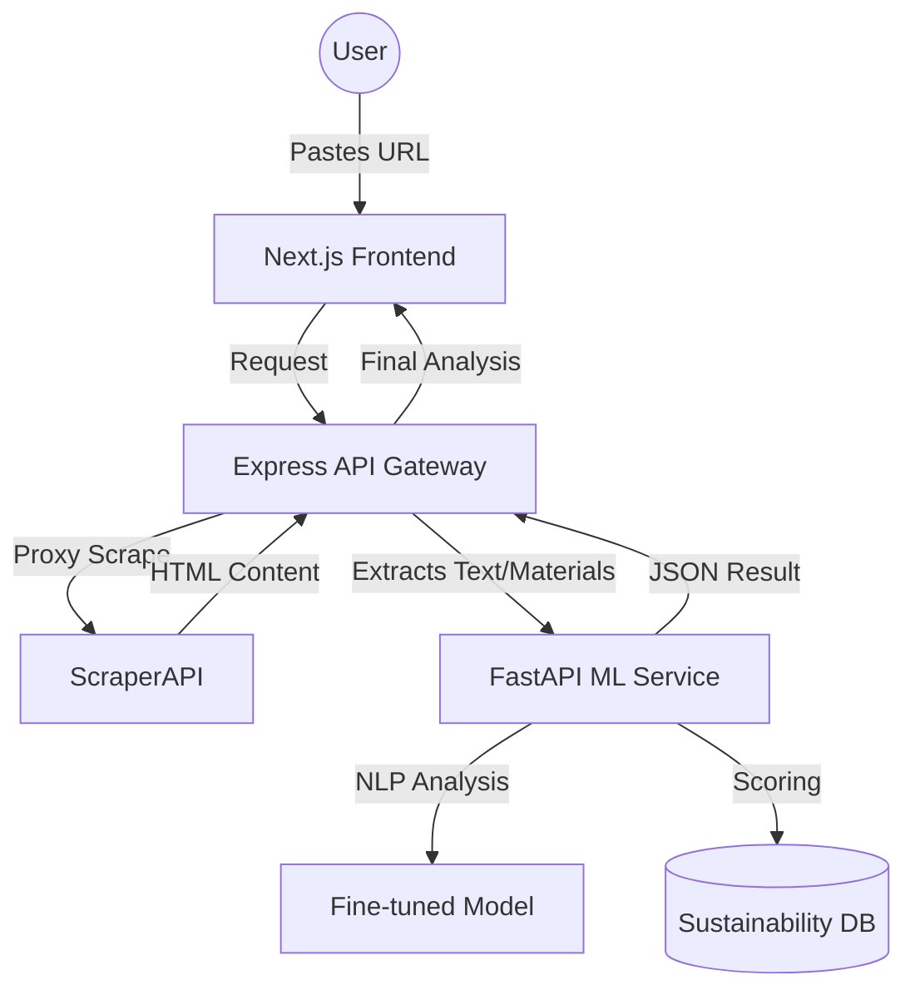

<div align="center">

# 🌿 VÉRA

### See Through the Greenwash.

[](https://vera.arinpattnaik.me/)
[](LICENSE)
[](https://nextjs.org/)
[](https://fastapi.tiangolo.com/)

**VÉRA is an industry-grade NLP-powered greenwashing scanner for the fashion industry.**
Stop falling for "sustainable" marketing. Paste a link, get the truth.

[**Try VÉRA Live**](https://vera.arinpattnaik.me/)

</div>

---

## ⚡ The Problem

Fast fashion brands spend millions on "eco-friendly" marketing, but most of it is **greenwashing**. Terms like "sustainable," "conscious," and "planet-friendly" have no legal definition. VÉRA uses advanced Natural Language Processing to dissect product claims and score them against real sustainability benchmarks.

## 🚀 Key Features

-   **🔍 Scalable Product Scraping**: Integrated with **ScraperAPI** to bypass anti-bot protections on major retailers (H&M, Zara, Nike, etc.).
-   **🧠 7-Stage NLP Pipeline**: Analyzes text for deceptive language, vague claims, and hidden trade-offs.
-   **📊 True Eco-Score (0-10)**: A proprietary scoring algorithm that cross-references material composition against global sustainability indexes.
-   **♻️ Material Transparency**: Automatically extracts and evaluates fabric percentages (e.g., Organic Cotton vs. Recycled Polyester).
-   **🏢 Brand Footprint**: Correlates product claims with corporate-level transparency data.

## 🛠️ Tech Stack

| Layer | Technology |
| :--- | :--- |
| **Frontend** | Next.js 14, React, Tailwind CSS, Framer Motion |
| **Backend API** | Node.js, Express, ScraperAPI (Proxying) |
| **ML Engine** | Python, FastAPI, HuggingFace (Transformers) |
| **Data Science** | Scikit-learn, Pandas, NLTK |
| **Deployment** | Vercel (Frontend), Render/Docker (Services) |

## 📐 Architecture



## 🏗️ Getting Started

### Prerequisites

-   Node.js (v18+)
-   Python (v3.10+)
-   Docker (Optional, for containerized deployment)
-   [ScraperAPI Key](https://www.scraperapi.com/)

### 1. ML Service (Python)
```bash
cd ml-service
python -m venv venv
source venv/bin/activate  # or venv\Scripts\activate on Windows
pip install -r requirements.txt
python main.py
```

### 2. Backend API (Node.js)
```bash
cd backend
npm install
# Create a .env file with:
# SCRAPER_API_KEY=your_key_here
# ML_SERVICE_URL=http://localhost:8000
npm start
```

### 3. Frontend (Next.js)
```bash
cd frontend
npm install
npm run dev
```

## 📝 License

Distributed under the MIT License. See `LICENSE` for more information.

---

<div align="center">
Built with 🌱 by <a href="https://github.com/ArinPattnaik">Arin Pattnaik</a>
</div>
